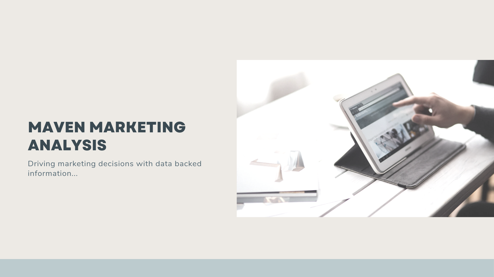
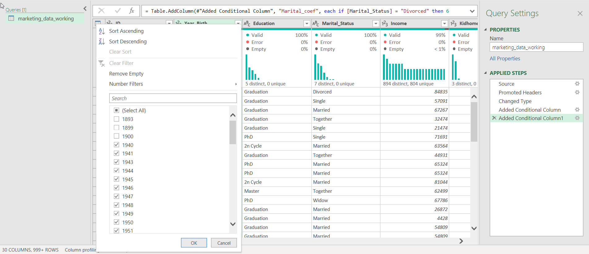
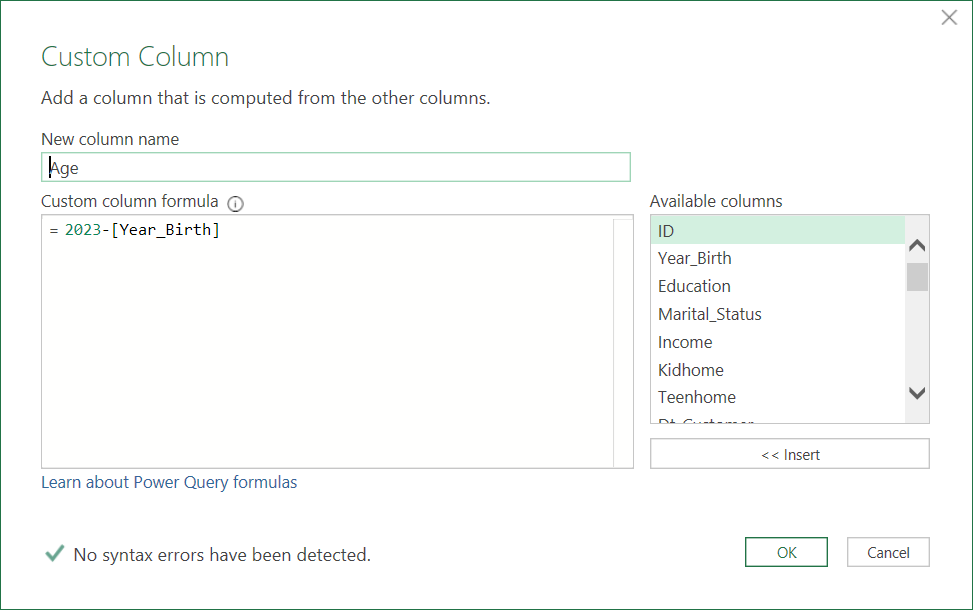
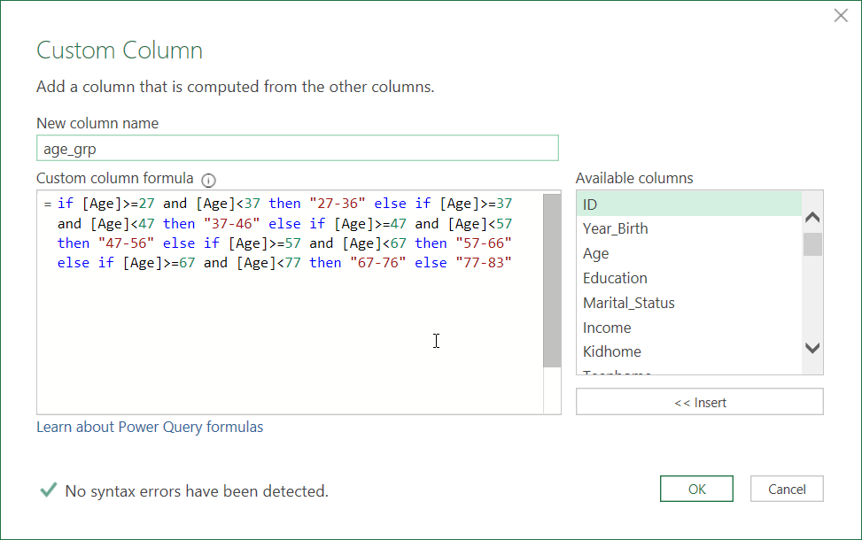
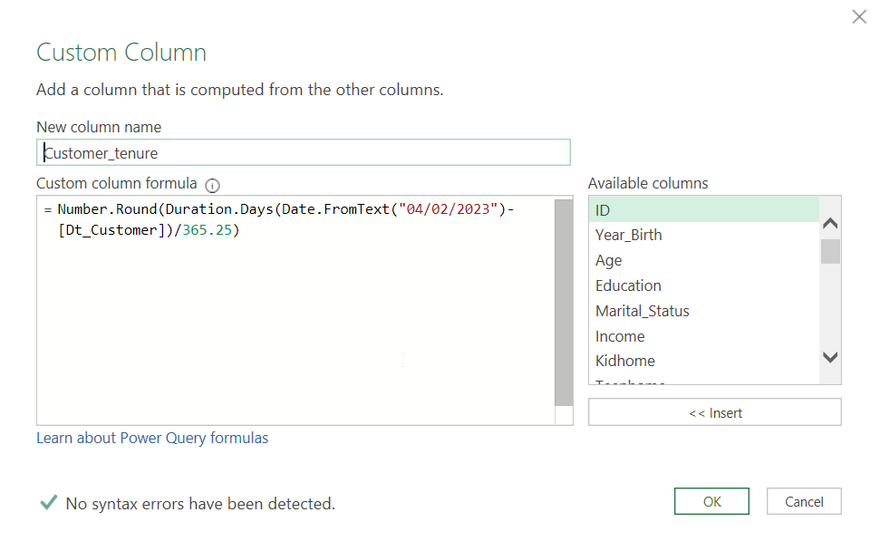
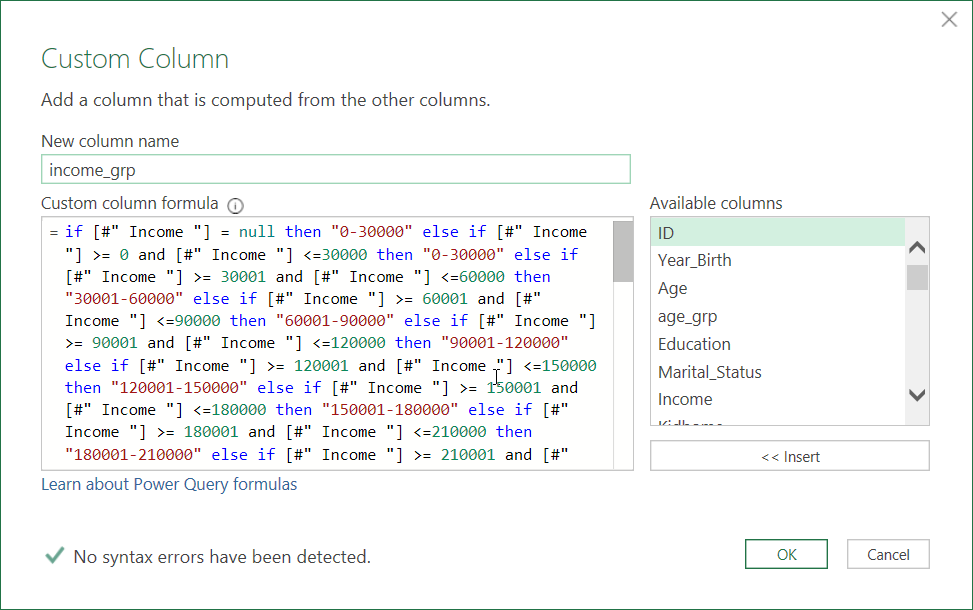
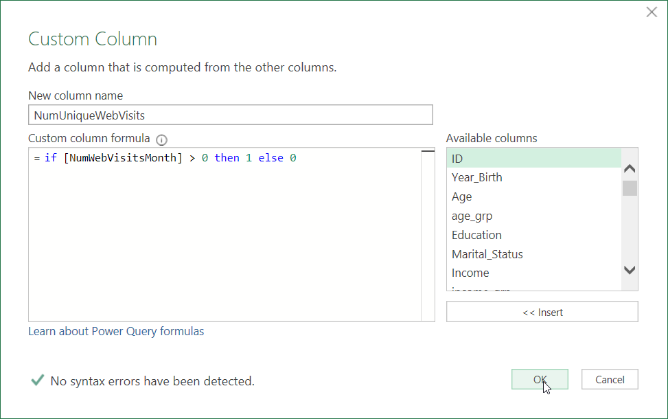
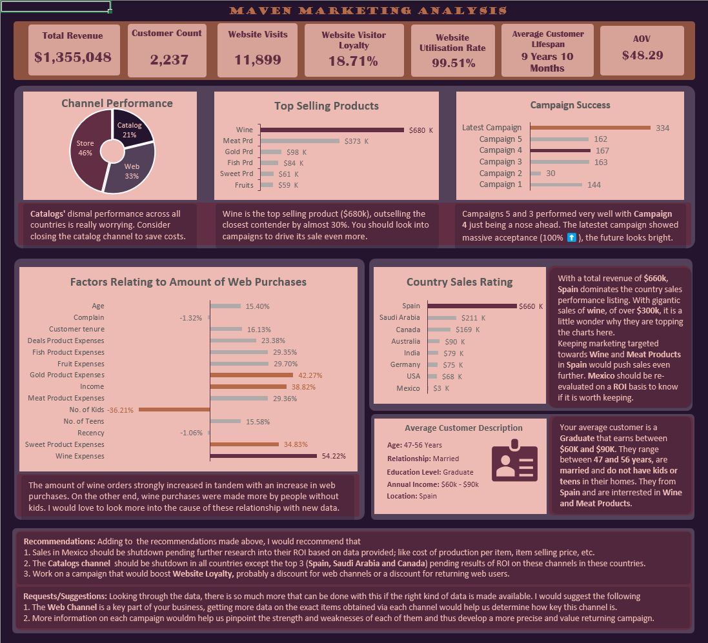

# Maven Marketing Analysis

## Introduction
Working with the dataset provided by [Tina Okonkwo](https://twitter.com/Rita_tyna) for her [#learnDataAnalyticsWithTina](https://twitter.com/hashtag/LearnDataAnalyticswithTina?src=hashtag_click) drive on Twitter, I was able to get insights and create recommendations for Maven Marketing using MS Excel.
Maven is a fictitious business which needed help with their sales and marketing, needing to tune each of them optimally with the aid of data.

**_Disclaimer:_** _The dataset used here and the reports generated does not represent any individual, company, institution or country; it is just an imaginary dataset to showcase things I am learning on my Data Analysis journey._

## Problem Statement

After a meeting with the client (Maven Marketing Team), my supervisor (Tina Okonkwo)🫡 reached out to me with the following queries that needed to be tended to:
1. What factors are significantly related to the number of web purchases?
2. Which marketing campaign was the most successful?
3. What does the average customer look like?
4. Which products are performing best?
5. Which channels are under-performing?
6. Provision of any other recommendation that might help improve sales.

## Skills/Concepts Demonstrated

In the course of this project, I was able to incorporate the following skills and Power Query features:
- DAX
- Data cleaning
- Data transformation

## Preamble and Cleaning

In a bid to put the data in an analysis ready form, some cleaning and transformation had to be carried out.
Upon inspection of the columns in power query, I noticed that some of the customers' **Year of Birth** were as far back as 1893, 1899 and 1900 which would make them 130, 124 and 123 year old respectively. As much as a lot of us pray to get that old, it remained an unrealistic scenario where people these aged still participated actively in shopping. This lead to my decision to drop those rows

Asides from the age issue, the dataset was clean and ready for some transformation. First on my list was to create an **Age** column from **Year_Birth**.

Then, I went on to classify the various ages in age groupings called **age_grp**.

Then I created a **Customer_tenure** column from the **Dt_customer** column. It is meant to help us know how many days the customer has been with the company.

I also created **income_grp** to group all customer incomes into classes fro easier analysis.

And to cap this up, knowing that I wanted to do some analysis on the web channel, I had to create **NumUniqueWebVisits**, which holds the unique visits on the website..

## Modelling

There is no modelling necessary here as this is a single table dataset.

## Visualisation

This report is made up of only one dashboard that holds the necessary insights and recommendations for this analysis.

## Analysis

#### Channel Performance
The Catalog channel was the least performer in every country across the board, although it did bring in some good revenue in the top 3 performing countries (Spain, Saudi Arabia and Canada). This pattern repeated itself in an almost identical manner across other metrics like Age grouping, Income grouping,etc.
I would suggest that this channel be closed down in all states apart from the three listed above and then ROI analysis should be carried out on this channel in the three countries.
No looking at the to performers (Store and Web), I can be noted that store put up a dominant stance across the boards but Web also showed itself as a good contender especially in the context of the average customer, by out selling catalog by 12.56% in the top 14 transactions of this demographic.

#### Top Selling products
With wine out-selling its closest competition (meat products) across the board by 29.15%, it stands out as the top selling product.🍷🥂

#### Campaigns and their success
**Campaign 4** narrowly clinched the top spot amongst campaign acceptance by customers. The latest campaign left all other campaigns before it in its shadow. This looks like the marketing team got things very right with this campaign; hopefully this leads to an equivalent leap in revenue generation.

#### Web Purchasing and Things Related to It
For this section, I only considered as important and relationship that is at least 30%. This **Wine expenses (54.22%), Gold product expenses (42.27%), No. of Kids (-36.21%), Income (38.82%) and Sweet product expenses (34.83%).** A hypothesis at the moment is that the strong relationship with wine sales is probably because most wine sales were carried out over the web channel. More data would be needed to test this hypothesis.

#### Which Countries Are Favourable to The Business?
**Spain** stole the limelight in the country race with **$660k** and with **wine** being the top seller in this country. On a flip note, Mexico could only raise a revenue of **$3k** in 2 years.
A detailed re-evaluation of Mexico will help determine if you should cut sales in that country all together.

#### Average Customer
The average customer is a **Graduate** that earns between **$60K and $90K**. They range between **47 and 56 years**, are **married** and do not have **kids or teens in their homes**. They from **Spain** and are interested in **Wine and Meat Products.**

## Conclusion and Recommendations
### Recommendation
1. With Mexico's under par, two year performance, I strongly suggest that sales be closed (even if temporary) in the country while a new strategy is drawn up for the market there.
2. A ROI based analysis of the **Catalog** channel will make clear which countries should shutdown their **Catalog** programs.
3. With Website Visitor Loyalty of **18.71%** there is a lot of room for improvement. With over 99% of your customers using your website, it would be smart to look into ways of improving website visitor loyalty like website optimisation, discounts for web purchases, groupons, etc.

I would strongly suggest looking into the data of the web channel (when you can put them together) to look for strengths that can be harnessed to further improve its success.
I also suggest this for all other sales channels.

## Closing

Hopefully we can get more information from our client in line with our requests and suggestions, then we can create a more helpful and thorough analysis.

## Appreciation and Closing

My gratitude goes out to Tina Okonkwo for pushing me on a structured path after I had done a bit of wandering by myself. The lessons I have learnt and keep learning are amazing.

A more detailed and insightful post that explains the whys behind the analysis can be found on medium [link to medium].

You can reach me on [Twitter](https://twitter.com/emmanwashili) or [LinkedIn](https://www.linkedin.com/in/emmanuel-nwashili-7051097b)
